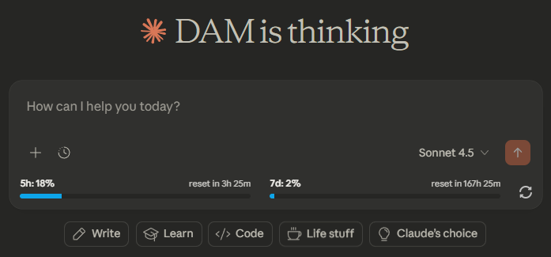
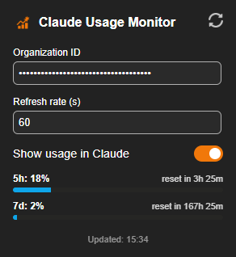

# Claude Usage Monitor

Chrome extension that displays your Claude AI usage limits directly on claude.ai.

## Preview

## Features

- In-page usage display with 5-hour and 7-day limits
- Color-coded progress bars (blue → red at 90%)
- Customizable refresh rate
- Quick access popup with usage stats
- Clickable header to open new Claude chat

## Installation

1. Clone this repository
2. Open Chrome and go to `chrome://extensions/`
3. Enable "Developer mode"
4. Click "Load unpacked" and select the `claudeStatistics` folder

## Setup

1. Click the extension icon
2. Enter your Claude Organization ID
3. (Optional) Adjust refresh rate in seconds

### Finding Your Organization ID

1. Go to [claude.ai](https://claude.ai)
2. Open Developer Tools (F12)
3. Go to Network tab
4. Send a message
5. Look for `/api/organizations/` request
6. Copy the org ID (format: `org_xxxxxxxxxxxxxxxxxxxxx`)

## Privacy

- Organization ID stored locally only
- No external data sharing
- Direct API calls to claude.ai

## License

Provided as-is for personal use.

## Disclaimer

Unofficial extension, not affiliated with Anthropic or Claude AI.